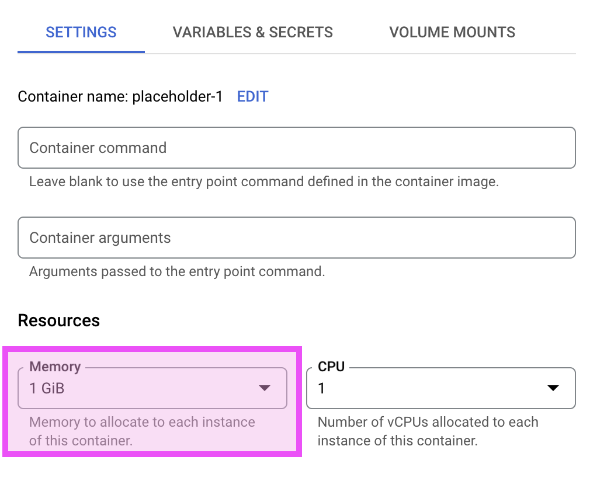
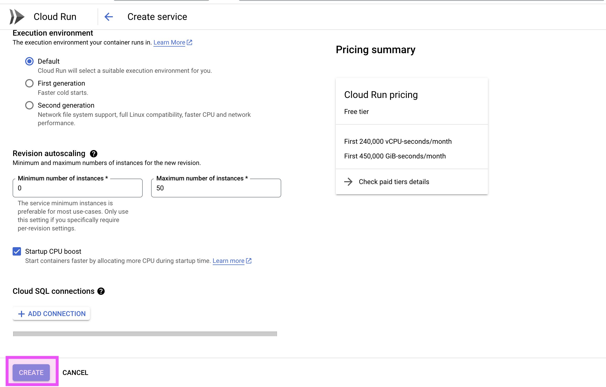

# NorCal Bird Dash 
The [dashboard is located at this link](https://birds-dash-547zxcr6ea-uc.a.run.app/),
with a [backup hosted on Dash here](https://bird-dash-slssljz5da-uc.a.run.app/).

## Table of Contents
- [Project Overview](#project-overview)
- [Features](#features)
- [Repository Description](#repository-description)
- [Requirements](#requirements)
- [Local Installation](#local-installation)
- [Global Installation](#global-installation)

## Project Overview
This repository contains a dashboard designed to visualize bird prevalence trends over different seasons across 260 species, with data sourced from iNaturalist and eBird.


## Repository Description
This repository contains the code for the NorCal Bird Dash application, a Dash app that monitors seasonality patterns of birds in Northern California.
```
├── Dockerfile          # Dockerfile for app build
├── LICENSE             # Liscensing info for repo
├── README.md           # Instructions about repository
├── app.py              # Script for deploying the dashboard
├── assets/             # Contains style formatting of dashboard
├── birds_dash.Rmd      # A prototype in R
├── birds_dash.html
├── data/               # Directory contain all data
│   ├── raw/            # Sub-directory contain all RAW data
│   └── smoothed/       # Sub-directory contain all SMOOTHED data
├── figures.py          # Script for each figure in the dashboard
├── images/             # Directory of images used in ReadMe instructions
└── requirements.txt    # Requirements needed for deploying application

```
## Requirements

To run the app globally, you will need a Google Cloud account.

### Google Cloud

To run the app globally, ensure you have:

- A [Google Cloud account](https://cloud.google.com/) with billing enabled.
- Google Cloud Command Line Interface (CLI) installed on your computer. See [Install the gcloud CLI](https://cloud.google.com/sdk/docs/install) for more information.


## Local Installation

To install this project locally, follow these steps:

1. Clone the repository:
    ```bash
    git clone https://github.com/codycarroll/birds_dash.git
    ```

2. Navigate to the project directory:
    ```bash
    cd birds_dash
    ```

3. Install the required dependencies:
    ```bash
    pip install -r requirements.txt
    ```

4. Run the app:
    ```bash
    python app.py
    ```

    

## Global Installation Tutorial

To host a project globally, use Google Cloud Run to host the dashboard. Google Cloud Run will build the dashboard from its GitHub repository and will relaunch the dashboard every time a new commit is made.

To deploy from the repository:

1. Go to [**Google Cloud Run**](https://console.cloud.google.com/run?enableapi=true&_ga=2.219764505.1499955565.1718826301-1656909028.1713804536&project=robust-atrium-400821) and click **Create service**.
    - <div align="left">
        <kbd></img></kbd>
      </div>

2. Select **Continuously deploy from a repository**. Click **Set up Cloud Build**.
    - <div align="left">
        <kbd></img></kbd>
      </div>

3. Ensure the **Source Repository** is correct and click **Next**.
    - <div align="left">
        <kbd></img></kbd>
      </div>

4. Under **Build Configuration** ensure the branch matches correctly and select **Dockerfile**. Click **Save**.
    - <div align="left">
        <kbd></img></kbd>
      </div>

5. Under **Authentication** select **Allow unauthenticated invocations**.
    - <div align="left">
        <kbd></img></kbd>
      </div>

6. Under **CPU allocation and pricing** select **CPU is always allocated** and set **Minimum number of instances** to 1.
    - <div align="left">
        <kbd></img></kbd>
      </div>

7. Press the arrow to expand **Containers, Volume, Networking, Security**.
    - <div align="left">
        <kbd></img></kbd>
      </div>

8. Under **Settings** set the **Memory** to 1 GiB.
    - <div align="left">
        <kbd></img></kbd>
      </div>

9. Click **Create**.
    - <div align="left">
        <kbd></img></kbd>
      </div>

10. If any issues arise during the building of the dashboard, click **logs** to inspect the problem. Click the **URL** to go to the dashboard!
    - <div align="left">
        <kbd></img></kbd>
      </div>


